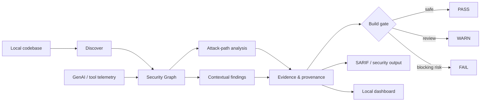

# Ethical Hacker v1.4.0

> **Architecture-aware defensive security analysis for modern software and AI systems.**

Ethical Hacker turns a codebase into a security graph, traces risky architecture paths, classifies findings by confidence, emits SARIF, and produces a confidence-aware `PASS / WARN / FAIL` build gate.

## At a glance

```text
Discover → Model → Attack → Observe → Prove → Gate
```

- Local-first scanning of real project files
- Architecture and attack-path graph analysis
- AI runtime, MCP/tool and Supabase-aware detection
- Confidence-aware findings to reduce false-positive blocking
- Differential security regression analysis
- SARIF output for code-scanning workflows
- Stateful browser dashboard
- **41/41 automated regression tests**

The scanner is passive and intended for systems you own or are explicitly authorized to assess. It does not perform live exploitation against third-party targets.

Ethical Hacker scans a local codebase, models security-relevant architecture as a graph, identifies risky paths and contextual findings, and applies confidence-aware `PASS / WARN / FAIL` build gating. It is designed for authorized defensive validation and local-first analysis.

## Architecture



The architecture is deliberately **passive and local-first**: it analyzes operator-supplied code and evidence rather than probing arbitrary third-party systems.

## Why this project exists

Traditional scanners often report isolated findings without explaining how components connect. Ethical Hacker adds an architecture layer: it models services, APIs, AI runtimes, MCP/tool surfaces and sensitive capabilities as a security graph, then evaluates attack paths and build risk from that context.

The result is a defensive workflow built around:

**Discover → Model → Attack → Observe → Prove → Gate**

## v1.4 highlights

- Stateful browser security dashboard
- Real-project filesystem scanning
- Architecture and attack-path graph analysis
- Confidence-aware findings
- `PASS / WARN / FAIL` build gate semantics
- Supabase, AI-runtime and MCP/tool-protocol detection
- Default exclusion of tests and fixtures from production-oriented scans
- Persistent latest-scan state in the local API
- SARIF output for CI and code-scanning workflows
- Differential security regression analysis
- OpenTelemetry-style GenAI/tool trace normalization
- Local-only HTTP server bound to `127.0.0.1` by default
- 41 automated regression tests

## Dashboard

Start the local dashboard:

```bash
npm run serve
```

Then open:

```text
http://127.0.0.1:8787
```

The dashboard exposes:

- Build-gate state
- Finding counts by severity
- Security graph node/edge counts
- Files scanned
- Confidence and domain for each finding
- Gate reasons
- High-risk attack paths
- Project/runtime detection metadata
- Scan timestamp and project path

Before a project is scanned, the dashboard reports `NOT_SCANNED` rather than presenting a misleading pass state.

## Quick start

Install requirements:

- Node.js
- npm
- Git

Run the full regression suite:

```bash
npm test
```

Run the dashboard:

```bash
npm run serve
```

Scan a project from the CLI:

```bash
npm run scan -- /path/to/project
```

Run the build gate:

```bash
npm run gate -- /path/to/project
```

Run the synthetic adversarial campaign:

```bash
npm run campaign -- 6
```

Run stress validation:

```bash
npm run stress
```

## Build gate

The build gate uses three outcomes:

| Status | Meaning |
| --- | --- |
| `PASS` | No blocking or warning condition was detected |
| `WARN` | The project contains a risk condition that should be reviewed but does not automatically block the build |
| `FAIL` | A blocking security condition was detected |

The gate is confidence-aware. Contextual references are not treated the same as confirmed security findings, which helps reduce false-positive build failures.

Examples of gate inputs include:

- Critical findings
- Confirmed high-severity findings
- High-risk attack chains
- Policy-as-code failures
- Security regression deltas

## Scan scope and false-positive control

Default scans exclude common non-production and generated content, including:

- `.git`
- `node_modules`
- build outputs
- coverage outputs
- tests
- fixtures
- generated reports

Tests and fixtures can be deliberately included when needed.

A project-level `.ethicalhackerignore` file can be used to control additional scan exclusions.

Service-role and secret-like references are classified with confidence levels such as:

- `CONFIRMED`
- `PROBABLE`
- `CONTEXTUAL`

For example, an empty example environment placeholder is treated as informational/contextual rather than as a confirmed secret.

## Architecture-aware detection

The current connector layer can identify and model signals including:

- Next.js API routes
- Supabase usage
- RLS indicators
- service-role and secret references
- AI/agent SDK indicators
- local AI subsystems
- MCP/tool-protocol indicators
- dependency inventory
- environment-variable references
- selected runtime execution surfaces

The scanner derives graph relationships from file-level evidence rather than relying only on project-wide inference.

## Attack graph

Ethical Hacker converts discovered architecture into a security graph and searches for risky paths.

A representative path may look like:

```text
project:root
  → service:ai
  → service:mcp
```

The graph is also used for:

- blast-radius analysis
- attack-chain discovery
- capability relationships
- API-to-service relationships
- build-gate warnings

The graph represents defensive architecture analysis; it does not perform live exploitation.

## Evidence and provenance

Security outputs are designed to remain replayable and auditable.

The project includes:

- Versioned scan envelopes
- SHA-256 evidence hashes
- Evidence-oriented security proofs
- Schema compatibility handling
- Raw provenance retention
- Standards mappings in `standards/registry.json`

Unknown connector-specific information can travel through extensions without requiring immediate core-schema changes.

## Observability and regression analysis

v1.3+ introduced:

- OpenTelemetry-style GenAI/tool trace ingestion
- Runtime edge derivation from telemetry
- Canary detection/prevention verification
- Differential security analysis between releases
- SARIF output

Example:

```bash
node cli.js diff before.json after.json
```

SARIF output can be generated from findings data or a project folder.

## Automated verification

v1.4.0 currently passes **41/41 automated tests**:

| Suite | Tests |
| --- | ---: |
| Core integrity | 10 |
| Advanced security/build gate | 9 |
| Connector and future-proofing | 10 |
| v1.3 regression | 6 |
| Dashboard/API regression | 6 |
| **Total** | **41** |

The regression suite covers areas including:

- trust laundering
- authority expansion
- scope expansion
- overload handling
- memory corruption
- blast radius
- attack-chain detection
- policy-as-code
- release security diffs
- build-gate behavior
- contextual finding handling
- connector extensibility
- Supabase/AI/MCP detection
- future-schema compatibility
- telemetry normalization
- SARIF output
- dashboard state transitions
- default test/fixture exclusion
- persisted latest-scan state

## Local-first security boundary

The scanner is intentionally passive.

It analyzes code and configuration supplied by the operator and does not probe arbitrary external systems.

The v1.4 HTTP server binds to:

```text
127.0.0.1
```

by default so the local filesystem-scanning API is not exposed to other devices on the network unless the operator explicitly changes the host configuration.

## Defensive-use boundary

This project is intended for systems you own or are explicitly authorized to test.

Synthetic adversarial campaigns model security-relevant state transitions and canary behavior without performing live exploitation against third-party targets.

## Project structure

```text
api/          Local HTTP API and dashboard state
connectors/   Extensible project-scanner connectors
core/         Integrity engine, graph, policy, proof and gate logic
fixtures/     Synthetic test projects
public/       Browser dashboard
standards/    Security-framework mappings
tests/        Regression, connector, advanced and API tests
cli.js        Command-line interface
```

## Release history

### v1.4.0 — Stateful security dashboard

- Stateful scan/API workflow
- Browser-triggered project scanning
- `NOT_SCANNED` initial state
- `PASS / WARN / FAIL` dashboard integration
- Confidence-aware findings
- Default test/fixture isolation
- Persistent latest-scan metadata
- Attack-path display
- Loopback-only server binding
- Dashboard/API regression tests

### v1.3.3 — Build-gate semantics

- Added `PASS / WARN / FAIL`
- Confidence-aware blocking
- High-risk attack-chain warnings
- Configurable gate thresholds

### v1.3.2 — Self-scan and classification fixes

- Suppressed detector-definition self-findings
- Added default test/fixture exclusions
- Added `.ethicalhackerignore`
- Added confidence classification for service-role references
- Reduced false positives from contextual environment references

### v1.3.1 — Real-project validation patch

- Detects local AI subsystems without requiring external model SDKs
- Distinguishes empty `.env.example` service-role placeholders from real references
- Builds API-to-service edges from file-level evidence
- SARIF accepts findings JSON or a project folder

### v1.3 — Discover → Model → Attack → Observe → Prove → Gate

- Adaptive synthetic adversarial campaigns
- GenAI/tool telemetry ingestion
- Canary verification
- Differential security regression analysis
- SARIF output
- Expanded CLI build-gate workflow

### v1.2 — Real-project connectors and future-proofing

- Plugin-style connector architecture
- Local filesystem project scanner
- Versioned scan envelopes
- Replay/provenance evidence
- Data-driven security-framework mappings

## License

MIT
